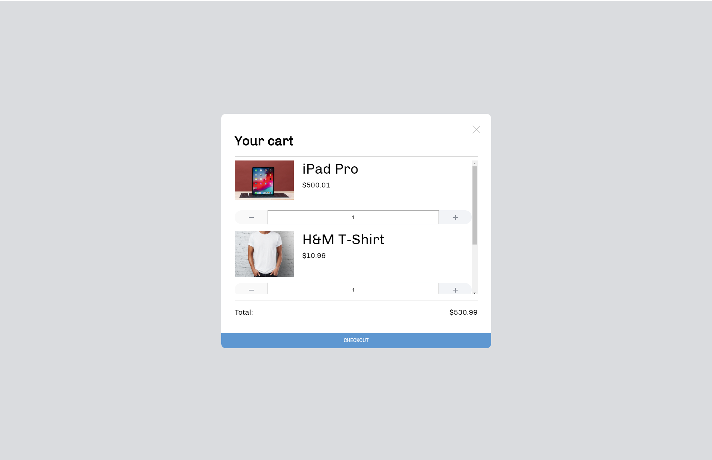
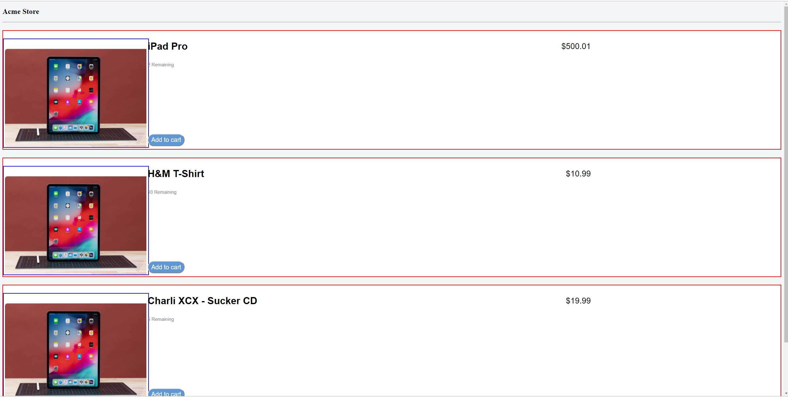
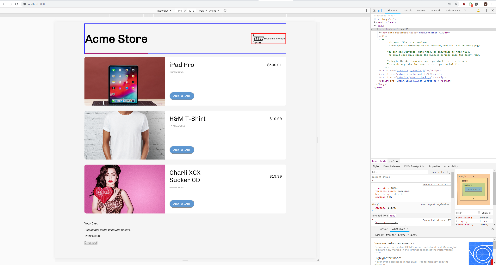
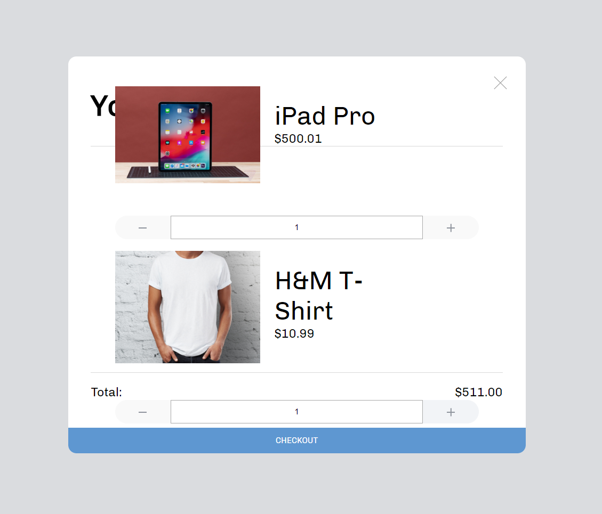
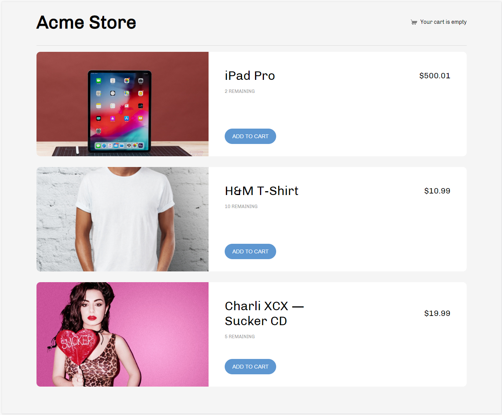
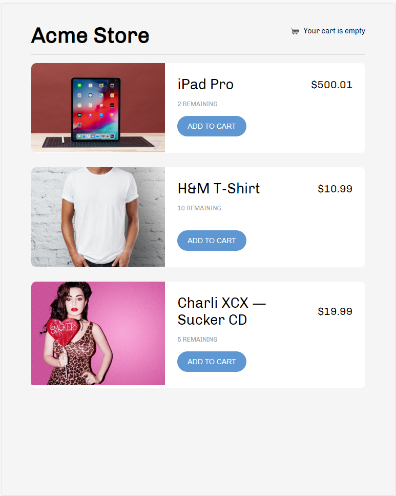
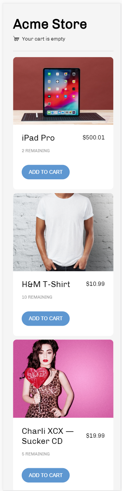
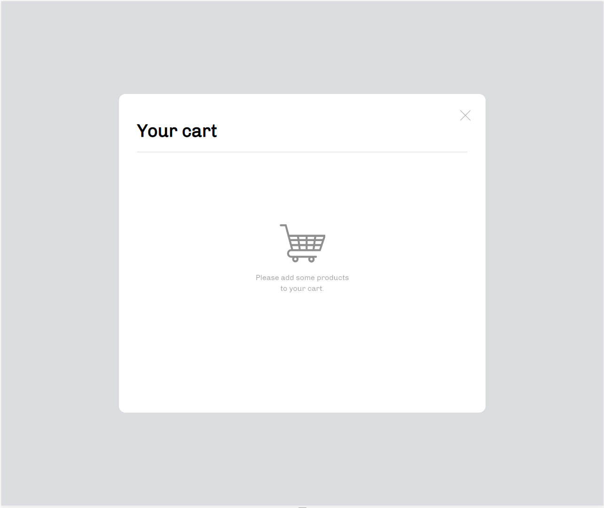
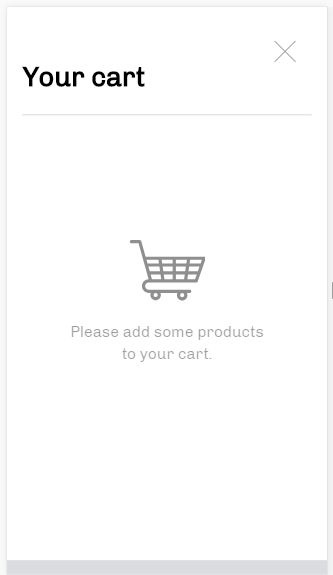
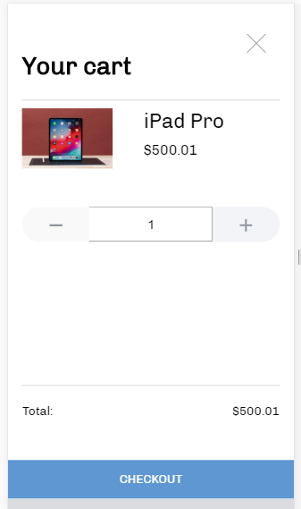

# Work & Co Web Code Assessment

This is my solution to the [Work & Co Web Code Assessment](https://github.com/workco/code-assessment-web) which is in turn a modified version of the [Redux Shopping Cart Example](https://github.com/reactjs/redux/tree/master/examples/shopping-cart).

To try it for yourself, either clone or download this repo to your local machine, install all the dependencies and start a development server. To install dependencies, use the package manager [Yarn](https://yarnpkg.com/en/):

```
yarn
```

Afterwards, to start a development server:

```
yarn start
```


## Task 1A: Implement Responsive Design (Products List)

First things first, actually implement the given breakpoints into code! As per the instructions, it should be responsive and not adaptive.

1. I'm on a Windows machine so I don't have the Helvetica Neue Font, sorry about that! As far as I can see though, it's only used in a handful of places. I continue to use Chivo instead.

2. I tried to make the project as Responsive as possible so for things like the "Acme Store" header, I use a minimum of 26px font added to a 2vw scaling factor. This means that "Acme Store" scales linearly with screen width but it also means it's not exactly accurate to the Breakpoints. Based off the task explanation though, I felt that it was more important to have responsive text that captures the essence of the sketch rather than follow the sketch exactly to a tee.

3. That being said, there are exceptions that I handled on a case by case basis. The price of the items are 21px in Breakpoints 1 and 2 despite the breakpoints having different widths. The price of the items in Breakpoint 3 is 16px so I handled that adaptively rather than responsively because the sketch file made it clear that that particular piece of text should not scale linearly with width.

After working on this project for many hours, I've learned that sometimes combining Responsive and Adaptive design allows for the best results. For example in ProductsList.scss/PrudctsList.css:

'''
.infoWrapper{
    padding: calc(16px + 1%);
    width: 100%;
    @include breakpoint(phone) {
        padding: 3.75%; //
    }
}
'''

I noticed the padding of the product information in their respective boxes has a constant ratio between the tablet and PC versions of the website. However, this falls through on the mobile version - the width is too small to maintain that ratio and that's reflected in the sketh drawings. Therefore, I chose to use a different formula for mobile specifically. Both formulas are Responsive formulas, but the method I use to choose the formula is Adaptive.

## Task 1B: Implement Responsive design (Shopping Cart)

After implementing the Products List, it's time to make the shopping cart look as it should. To implement the shopping cart, I use [react-modal](https://github.com/reactjs/react-modal) as it does exactly what we need it to with a good amount of examples and documentation to follow.  

1. One of the most conceptually difficult parts of the shopping cart was how to handle multiple products. The sketch doesn't clearly show exactly how we should handle overflow in this case and it's almost bound to happen because there's not enough room to hold all 3 products on the screen. I elected to use a scrollbar to handle this scenario but thankfully the scrollbar only appears when actually needed. You can see a screenshot of it in action below.

[]

## Future Improvements

Although I'm proud of my solution, it is by no means perfect and there is plenty to do still. The biggest one, of course, is that the original Code Assessment has two other tasks to do and I haven't done them yet. My code also doesn't perfectly match the breakpoints nor is it perfectly responsive so there's some small improvements to be made in both of those areas. My solution sometimes also doesn't play nicely with abnormally high or low resolutions which is something that needs to be resolved.


## In-Progress Screenshots

# First attempt at Products List
[]

# Products List nearly Finished
[]

# Semi-Working cart
[]

## Finished Screenshots

# Breakpoint1
[]

# Breakpoint2
[]

# Breakpoint3
[]

# FinishedCart1
[]

# FinishedCart2
[]

# FinishedCart3
[]
